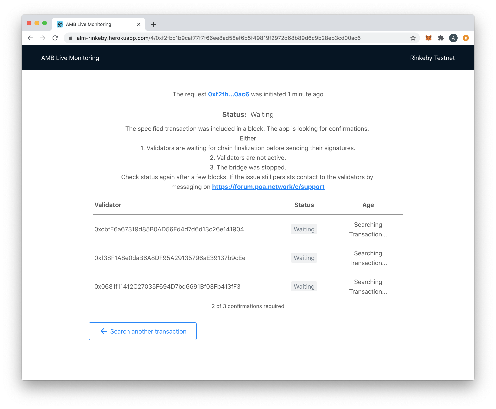
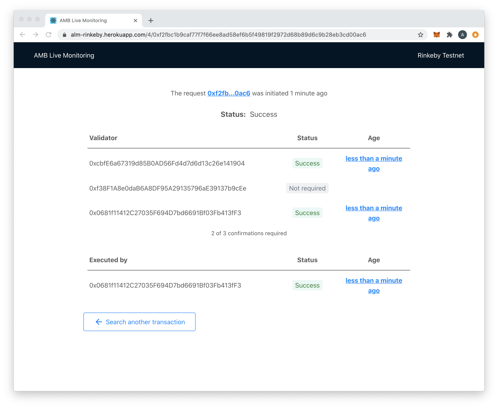
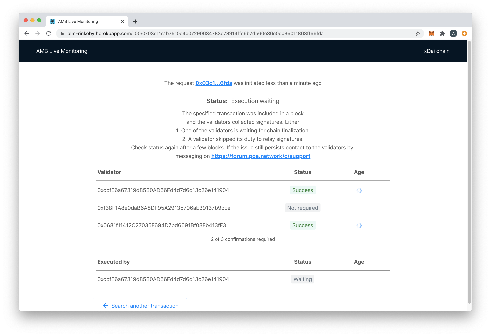
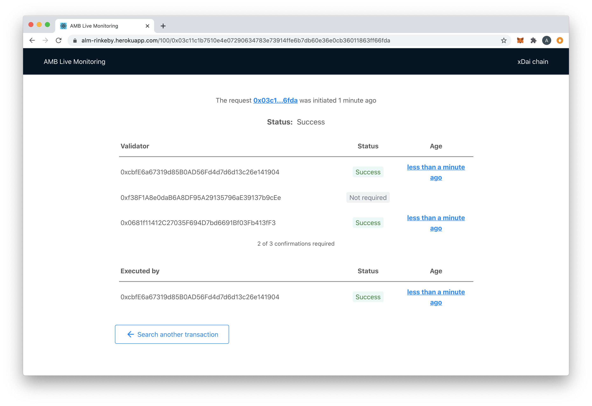

# ALM transition states

## Foreign -&gt; Home State Transitions

A request sent through an Arbitrary Message Bridge mediator from the Foreign chain can be in different states depending on the status of the bridge validators operations.

Below is a table with the description of possible states and clarifications what exactly this state means.

<table>
  <thead>
    <tr>
      <th style="text-align:left">Status</th>
      <th style="text-align:left">Description</th>
      <th style="text-align:left">Clarification</th>
    </tr>
  </thead>
  <tbody>
    <tr>
      <td style="text-align:left">Error</td>
      <td style="text-align:left">Transaction not found.
         1. Check that the transaction hash is correct.
         2. Wait several blocks for the transaction to be mined, gas price effects
        mining speed.</td>
      <td style="text-align:left">The transaction specified by the user not found.</td>
    </tr>
    <tr>
      <td style="text-align:left">Waiting</td>
      <td style="text-align:left">The specified transaction was included in a block. Validators are waiting
        for chain finalization before sending their confirmations.</td>
      <td style="text-align:left">The transaction specified by the user was included in a block but the
        bridge validators are waiting for a number new blocks to consider the state
        of the chain as final.
         The number of the blocks can be get by the method requiredBlockConfirmations()
        of the bridge contract.</td>
    </tr>
    <tr>
      <td style="text-align:left">Waiting</td>
      <td style="text-align:left">
        
The specified transaction was included in a block. The app is looking
          for confirmations. Either

        
1. Validators are waiting for chain finalization before sending their
          signatures.

        
2. Validators are not active.

        
3. The bridge was stopped.

      </td>
      <td style="text-align:left">The transaction specified by the user was included in a block but no transactions
        from any validator have been found yet.</td>
    </tr>
    <tr>
      <td style="text-align:left">Waiting</td>
      <td style="text-align:left">The specified transaction was included in a block. Some validators have
        sent confirmations, others are waiting for chain finalization.</td>
      <td
      style="text-align:left">The transaction specified by the user was included in a block but the
        number of confirmations sent is not enough to consider the request as signed
        by the majority of the validators.
         The number of required signatures can be get by the method requiredSignatures()
        of the bridge contract.</td>
    </tr>
    <tr>
      <td style="text-align:left">Pending</td>
      <td style="text-align:left">The specified transaction was included in a block. A majority of validators
        sent confirmations which have not yet been added to a block.</td>
      <td style="text-align:left">It was discovered that enough confirmations were sent by the validators
        but most of them have not been mined yet.</td>
    </tr>
    <tr>
      <td style="text-align:left">Failed</td>
      <td style="text-align:left">The specified transaction was included in a block, but confirmations sent
        by a majority of validators failed. The cross-chain relay request will
        not be processed.</td>
      <td style="text-align:left">The number of failed confirmations does not allow the transaction to reach
        the required number of the signatures.</td>
    </tr>
    <tr>
      <td style="text-align:left">Success</td>
      <td style="text-align:left">Success</td>
      <td style="text-align:left">Enough number of transactions with the validators&apos; confirmations
        was included in the chain. The initial request to the relay data from one
        chain to another was successfully executed.</td>
    </tr>
  </tbody>
</table>

### Examples

The ALM will auto-update as the transaction progresses through different states. 

#### Waiting for a transaction

#### Success

Click on an age metric to view the transaction details in Etherscan.

## Home -&gt; Foreign State Transitions

Similar to requests sent from the Foreign chain, a request initiated from the Home chain also can be in different states. The number of states is larger since the bridge validators performs more operations to relay the request.

Below is a table with the description of possible states and clarifications what exactly this state means.

In Home -&gt; Foreign transactions there are waiting/pending states for confirmation as well as for execution.

<table>
  <thead>
    <tr>
      <th style="text-align:left">Status</th>
      <th style="text-align:left">Description</th>
      <th style="text-align:left">Clarification</th>
    </tr>
  </thead>
  <tbody>
    <tr>
      <td style="text-align:left">Error</td>
      <td style="text-align:left">Transaction not found.
         1. Check that the transaction hash is correct.
         2. Wait several blocks for the transaction to be mined, gas price effects
        mining speed.</td>
      <td style="text-align:left">The transaction specified by the user not found</td>
    </tr>
    <tr>
      <td style="text-align:left">Confirmation Waiting</td>
      <td style="text-align:left">The specified transaction was included in a block. Validators are waiting
        for chain finalization before sending their signatures.</td>
      <td style="text-align:left">The transaction specified by the user was included in a block but the
        bridge validators are waiting for a number new blocks to consider the state
        of the chain as final.
         The number of the blocks can be get by the method requiredBlockConfirmations()
        of the bridge contract.</td>
    </tr>
    <tr>
      <td style="text-align:left">Confirmation waiting</td>
      <td style="text-align:left">
        
The specified transaction was included in a block. The app is looking
          for confirmations. Either

        
1. Validators are waiting for chain finalization before sending their
          signatures.

        
2. Validators are not active.

        
3. The bridge was stopped.

      </td>
      <td style="text-align:left">The transaction specified by the user was included in a block but no transactions
        from any validator have been found yet.</td>
    </tr>
    <tr>
      <td style="text-align:left">Confirmation Waiting</td>
      <td style="text-align:left">The specified transaction was included in a block. Some validators have
        sent signatures, others are waiting for chain finalization.</td>
      <td style="text-align:left">The transaction specified by the user was included in a block but the
        number of confirmations sent is not enough to consider the request as signed
        by the majority of the validators.
         The number of required signatures can be get by the method requiredSignatures()
        of the bridge contract.</td>
    </tr>
    <tr>
      <td style="text-align:left">Confirmation Pending</td>
      <td style="text-align:left">The specified transaction was included in a block. A majority of validators
        sent signatures which have not yet been added to a block.</td>
      <td style="text-align:left">&#x201D;requiredSignatures&#x201D; or more validators sent confirmations
        but most of them were not mined yet</td>
    </tr>
    <tr>
      <td style="text-align:left">Confirmation Failed</td>
      <td style="text-align:left">The specified transaction was included in a block, but transactions sent
        by a majority of validators failed. The cross-chain relay request will
        not be processed.</td>
      <td style="text-align:left">Confirmations of &#x201D;requiredSignatures&#x201D; or more validators
        were successfully included into blocks</td>
    </tr>
    <tr>
      <td style="text-align:left">Execution Waiting</td>
      <td style="text-align:left">
        
The specified transaction was included in a block and the validators collected
          signatures. Either
           1. One of the validators is waiting for chain finalization.
           2. A validator skipped its duty to relay signatures.
           3. The execution transaction is still pending (e.g. due to the gas price
          spike).

        
Check status again after a few blocks.

      </td>
      <td style="text-align:left">Signatures were collected in the Home chain but the transaction from the
        validator to forward signatures was not yet found on the Foreign side.
         It could be also due to a specific RPC endpoint used for the chain - the
        oracle sent the transaction to the Foreign side but it is not possible
        to found it due to the RPC endpoint functionality (e.g. on Infura)</td>
    </tr>
    <tr>
      <td style="text-align:left">Execution Pending</td>
      <td style="text-align:left">The specified transaction was included in a block and the validators collected
        signatures. The validator&#x2019;s transaction with collected signatures
        was sent but is not yet added to a block.</td>
      <td style="text-align:left">It was discovered that enough confirmations were sent by the validators
        but most of them have not been mined yet.</td>
    </tr>
    <tr>
      <td style="text-align:left">Execution Failed</td>
      <td style="text-align:left">The specified transaction was included in a block and the validators collected
        signatures. The validator&#x2019;s transaction with collected signatures
        was sent but did not succeed.</td>
      <td style="text-align:left">The transaction with collected signatures was included in a block on the
        Foreign side but its status is &#x201C;failed&#x201D;.</td>
    </tr>
    <tr>
      <td style="text-align:left">Success</td>
      <td style="text-align:left">Success</td>
      <td style="text-align:left">The transaction with the collected signatures was applied successfully
        to the Foreign chain. The initial request to the relay data from one chain
        to another was successfully executed.</td>
    </tr>
  </tbody>
</table>

###  Examples

The ALM will auto-update as the transaction progresses through different states. 

#### Waiting for Execution

#### Success

Click on an age metric to view the transaction details in BlockScout.

