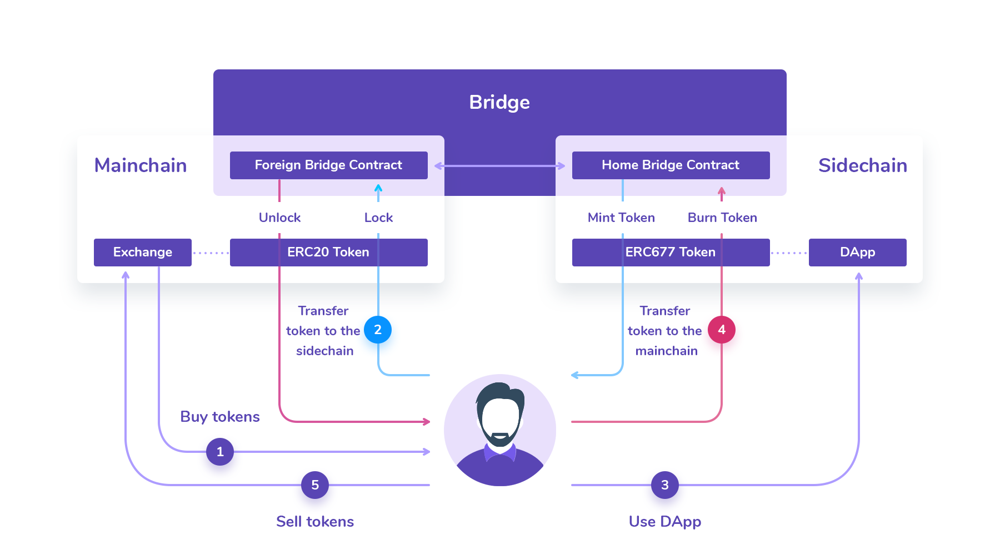

# TokenBridge Roles

Administrators on the TokenBridge are responsible for bridge security and upgrades. Every bridge has 2 sides - smart contracts are deployed on each side of the bridge. A side is referred to as either the Home \(or Native\) side or the Foreign side, depending on the bridge mode.

General information regarding the TokenBridge can be found in [Features & Definitions](./)

For detailed configuration options and bridge parameters see [xDai bridge contracts management](../../xdai-bridge/xdai-bridge-contracts-management/)

### Multisignature requirements

Multisignature \(multisig\) wallet functionality is required for TokenBridge administrators. Multiple parties must agree on operations before an action is executed.

### Administrative Groups and Roles

Administrators on the bridge manage the bridge smart contracts. Validators can be setup as administrators, or separate entities can fulfill this position. The groups are responsible for the following on **each side** of the bridge:

**Group A \(Manages validator set\)**

* Adds or removes validators
* Sets minimum required signatures from validators in order to relay a user's transaction

**Group B: \(Manages bridge parameters\)**

* Sets daily limits for users and validators
* Sets min/max per transaction limits
* Sets fallback gas price
* Sets finalization threshold

  **Group C: \(Manages upgrades\)**

* Upgrades contracts in case of vulnerability
* Unlocks funds

### Administrative Groups Setup

There are 3 administrative roles required for each side of the bridge, resulting in a total of 6 administrative groups responsible for these roles. Each group requires a multisig \(the minimum number of signatures is configurable\) to confirm an action.

The admin group setup can be customized in the bridge settings. For example, the same group of administrators may control multiple groups with a single multisig, or each administrative group may be a distinct entity with different multisig requirements.

In addition, validators on each chain require multisig operations, but this is built-in to the contracts.

**Chain 1**

* Group A \(1\)
* Group B \(2\)
* Group C \(3\)
* Validators \(elected by group A\) \(4\)

**Chain 2**

* Group A \(5\)
* Group B \(6\)
* Group C \(7\)
* Validators \(elected by group A\) \(8\)

### Validator Roles

Validators do not manage smart contracts in the bridge setup \(unless they are also given an administrative role\). They are managed by Administration Group A. Validators in the network are responsible for:

* Providing 100% uptime to relay transactions
* Listening for `UserRequestForSignature` events on the Home side and signing an approval to relay assets on the Foreign side
* Listening for `CollectedSignatures` events on the Home side. Once enough signatures are collected, transferring all collected signatures to the Foreign side.
* Listening for `UserRequestForAffirmation` or `Transfer` \(depending on the bridge mode\) events on the Foreign side and sending approval to the Home side to relay assets from Foreign Network to Home.

### User Roles

Users send assets to the bridge contracts and receive corresponding assets in return.

1. NATIVE-TO-ERC mode: send native coins to the Home bridge contract to receive ERC20 tokens from the Foreign bridge contract, send ERC20 tokens to the Foreign bridge contract to unlock native coins from the Home bridge contract.
2. ERC-TO-NATIVE mode: send ERC20 tokens to the Foreign bridge contract to receive native coins from the Home bridge contract, send native coins to the Home bridge contract to unlock ERC20 tokens from the Foreign bridge contract.
3. ERC-TO-ERC mode: transfer ERC20 tokens to the Foreign bridge contract to mint ERC20 tokens on the Home network, transfer ERC20 tokens to the Home bridge contract to unlock ERC20 tokens on the foreign network;

#### Example User Diagram for the `ERC-to-ERC` Bridge

