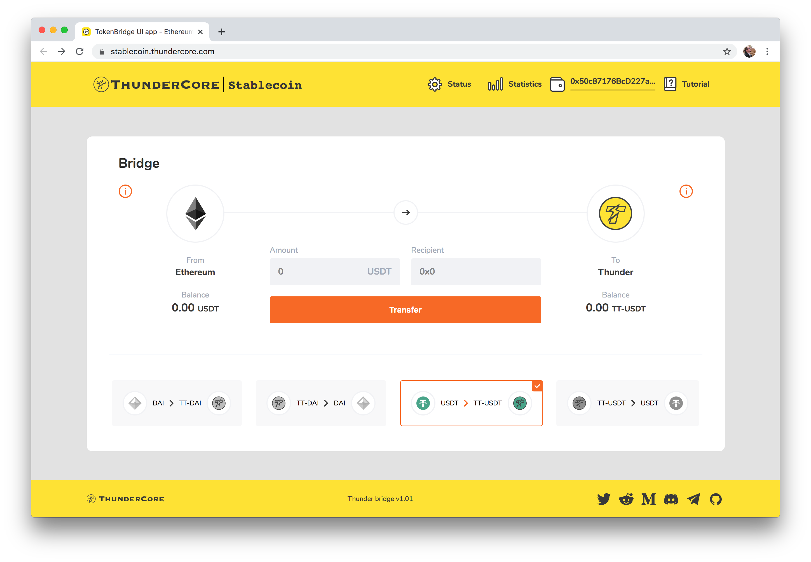
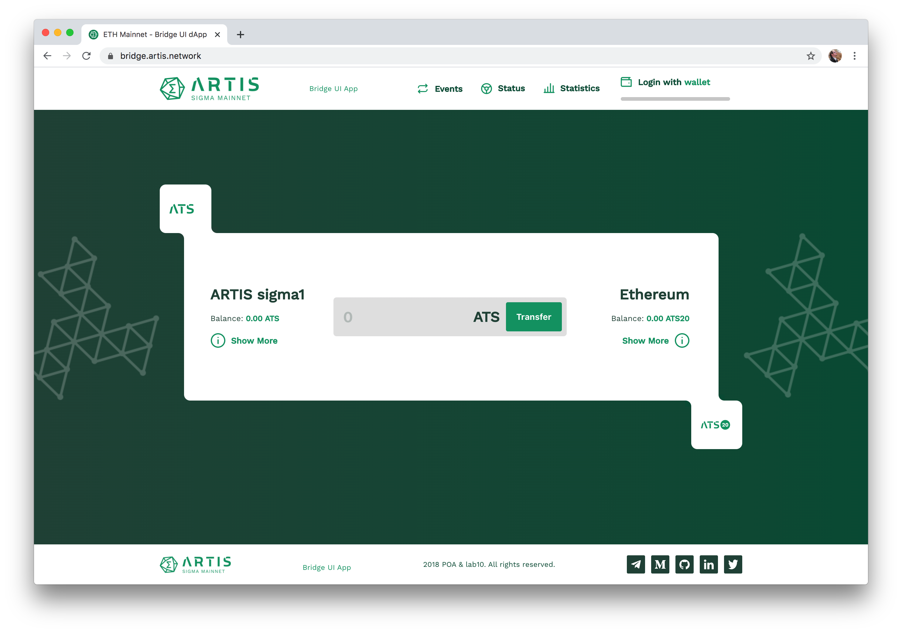
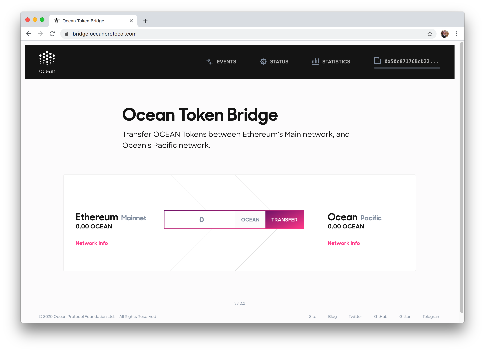

# Cross-Chain Project Highlights

## **Projects using the TokenBridge solution for token transfers**

> **Project:** [Thundercore](https://www.thundercore.com/)  
> **Bridge UI:** [**https://stablecoin.thundercore.com/**](https://stablecoin.thundercore.com/)  
> **Description:** ThunderCore ERC20 &lt;-&gt; ERC20 Stablecoin bridge for USDT and Dai.

> **Project:** [EtherCore](https://www.ethercore.io/)  
> **Bridge UI:** [**https://bridge.ethercore.io/**](https://bridge.ethercore.io/)  
> **Description:** EtherCore Mainchain &lt;-&gt; EtherCore SideChain bridge for the ERE token

> **Project:** [Artis](https://artis.eco/)  
> **Bridge UI:** [**https://bridge.artis.network/**](https://bridge.artis.network/)  
> **Description:** ATS &lt;-&gt; ATS20 on the Ethereum Mainnet

> **Project:** Ocean  
> **Bridge UI:** [https://bridge.oceanprotocol.com/](https://bridge.oceanprotocol.com/)  
> **Description:** Transfer OCEAN tokens between Ethereum and the Ocean Pacific Network

