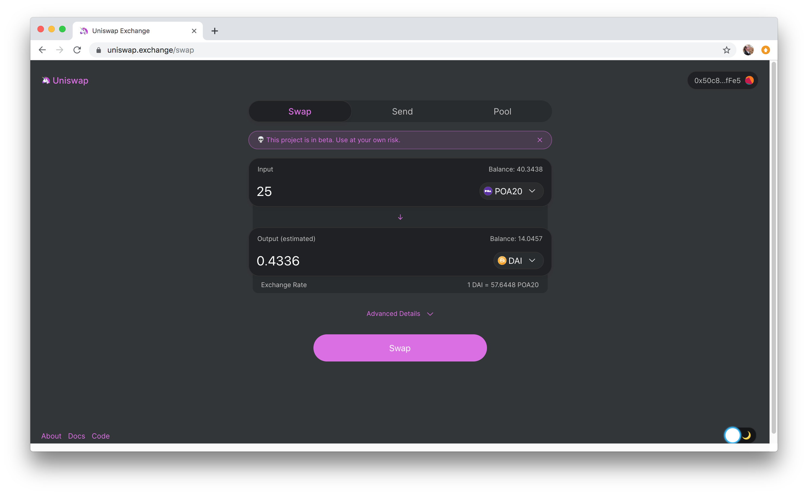

# Mainnet Participation

While sidechains and private chains provide many benefits to users, interaction with the Ethereum mainnet is also important. Transferring assets from a sidechain to the mainnet opens up opportunities for broader audience interaction, additional liquidity options, and participation in mainnet applications like DEXs.&#x20;

### POA20 on Uniswap

POA, a native coin on the POA Network, is bridged to POA20, an ERC20 token on the Ethereum mainnet. Once bridged, POA20 can be used at a variety of exchanges. One of these is Uniswap, where a user can swap POA20 for other tokens (like ETH, DAI and many others), swap and send tokens to another address, or add POA20 liquidity to the pool. All functionality is available without the need to provide KYC information.

### Success Factors


Bridging from a sidechain token to an ERC20 on the mainnet provides a number of liquidity options.

