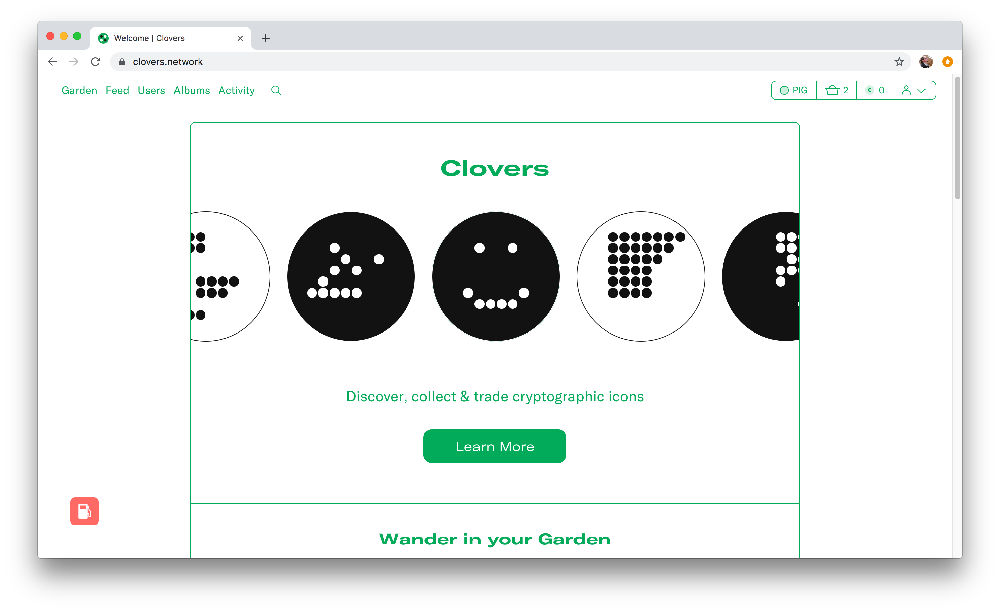

# Reduce Computation Costs

Gas fees add up quickly for many Ethereum smart contracts, and transferring expensive operations to a sidechain can reduce costs significantly. With the AMB (Arbitrary Message Bridge) mode, users may leverage minimal up-front costs on a sidechain when creating assets, then bridge those assets to the mainnet to access a broader user base.

### Clovers Network

When [clovers.network](https://clovers.network) first started, all of their contracts and operations were deployed to the Ethereum mainnet. However, gas fees made clover creation (clovers are non-fungible tokens (NFTs)) and claiming costly .

To help with expensive operation costs,  clovers.network is shifting their contracts to the POA Network. Here, clovers can be created with minimal transaction costs. Then, to reach potential clover buyers, users can bridge their rare NFTs to the mainnet marketplace using the AMB bridge.&#x20;

Potential sellers can reach a larger user base of buyers on the mainnet, and interested individuals can use ETH to purchase clovers.

### Success Factors


The AMB bridge offers users the ability to move NFTs between chains, providing a sidechain scaling solution and manageable gas fees.

