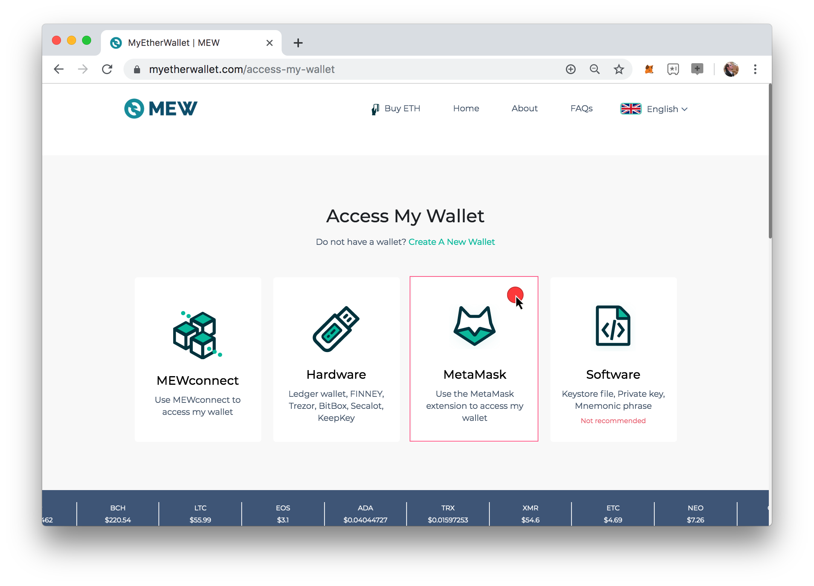

# MyEtherWallet \(MEW\) Transfer

## **Transfer a Kitty from Kovan to Sokol** 


You will need a small amount of KETH to complete the transfer.  You can obtain here: [https://gitter.im/kovan-testnet/faucet](https://gitter.im/kovan-testnet/faucet)



In this tutorial we use MetaMask to connect to MyEtherWallet\(MEW\). Some processes may not work using a different connection method.


### 1\) Login to [MyEtherWallet](https://www.myetherwallet.com/) using MetaMask and switch to the Kovan Network.

You will now be connected to Kovan \(KOV\) through Metamask.

### 2\) Approve the token you will transfer with the bridge

* Open a second browser tab to view[ the Kitties contract in Blockscout](https://blockscout.com/eth/kovan/address/0x13ac5c6338796a31a39e74d70b0153c1be5f53b4/contracts). Go to the  tab, **scroll down** below the Contract Source Code, and copy the Contract ABI code.

* Back in MEW, select **Contract** from the left hand menu \(you may need to expand your browser window to see\) and enter:
  * 1\) Contract Address:  `0x13ac5c6338796a31a39e74d70b0153c1be5f53b4` 
  * 2\) Copied ABI to the ABI/JSON interface text area.
  * 3\) Click **Continue**

* In the Read/Write Contract Interface
  * 1\) choose the `approve` method from the **Select an Item** dropdown menu. 
  * 2\)  **\_to\(address\):** `0x7dB6493D9B6D99D9A240a6914AdAd5e0E8E8BE40`
  * 3\) **\_tokenId**: insert the Id of the token you own that you want to transfer to Sokol. 
  * 4\) **Value in Eth:** Keep at 0
  * 5\) Press `Write`

* After the success message, confirm the transaction in MetaMask. Once confirmed, Press **Back** in the MEW interface.

###    3\)  Initiate the token transfer:

* Open a second browser tab to view [Mediator contract in BlockScout](https://blockscout.com/eth/kovan/address/0xa58728538b77680f303e07d418259a68d3e66991/contracts). **Scroll down** below the Contract Source Code and **copy the Contract ABI code**.
* Add the contract to MEW
  * 1\) Contract Address:  `0x7db6493d9b6d99d9a240a6914adad5e0e8e8be40` 
  * 2\) Copied ABI to the ABI/JSON interface text area.
  * 3\) Click **Continue**

* In the Read/Write Contract Interface
  * 1\) Execute the `transferToken` method from the dropdown menu
  * 2\)  **\_from** : paste **your account address** \(can copy from MetaMask\)
  * 3\) **\_tokenId:** insert the Id of the token you own
  * 4\) **Value in Eth:** 0
  * 5\) Press `Write` and complete the transaction confirmation through MetaMask

As soon as the transaction is confirmed,  the token will be locked in the Mediator contract in Kovan \(`0x7db6493d9b6d99d9a240a6914adad5e0e8e8be40`\). [Check Token Holders here](https://blockscout.com/eth/kovan/tokens/0x13ac5c6338796a31a39e74d70b0153c1be5f53b4/token_holders).

After waiting several seconds to allow for AMB bridge operations, check the [token contract on Sokol](https://blockscout.com/poa/sokol/tokens/0xc6a592ED792de33e6CBBF7ce04Dd9D3884B46B9A/inventory) to confirm the bridges token is minted on Sokol with the same Id and metadata

## **Transfer Kitty from Sokol to Kovan**


The process is identical to the above process other than  using different contract addresses. 

You can get Sokol Test Tokens here: [https://faucet-sokol.herokuapp.com/](https://faucet-sokol.herokuapp.com/)


1. Make sure that you are on the Sokol network in MEW
2. Approve the token to be transferred by the bridge:
   * Visit [the Kitties contract in Blockscout](https://blockscout.com/poa/sokol/address/0xc6a592ED792de33e6CBBF7ce04Dd9D3884B46B9A/contracts), go to the **Code** tab and copy ABI there.
   * Add the contract to MEW by using the address `0xc6a592ED792de33e6CBBF7ce04Dd9D3884B46B9A` and copied ABI.
   * Make a transaction to execute the `approve` method
     *  `_to` parameter:`0x7dB6493D9B6D99D9A240a6914AdAd5e0E8E8BE40`, in `_tokenId` parameter insert the Id of the token you want to transfer. 
     * Press `Write` and confirm the transaction confirmation.
3. Initiate the token transfer:
   * Visit in another browser tab [the Mediator contract in Blockscout](https://blockscout.com/poa/sokol/address/0x521211789711e7048e900d16310e1de940b1e53b/contracts) and scroll down to copy the ABI
   * Add the contract to MEW by using the address `0x5EeC77239398FE328791E28700CAFddB2990ea97` and copied ABI.
   * Make a transaction to execute the `transferToken` method
     *  `_from` parameter paste the address **of your account** that will receive the token on the other network
     *  `_tokenId` parameter insert the Id of the token you want to transfer. 
     * Press `Write` and confirm the transaction confirmation.

When the token is transferred in the opposite direction, it is **burned in Sokol** and unlocked on Kovan. After waiting a couple of seconds to allow the AMB bridge operations, check the [token contract on Kovan](https://blockscout.com/eth/kovan/tokens/0x13AC5C6338796a31A39e74D70B0153C1bE5f53B4/inventory) to see that the token bridged is now owned by your account again \(rather than the contract\) with the same ID and metadata as before.

