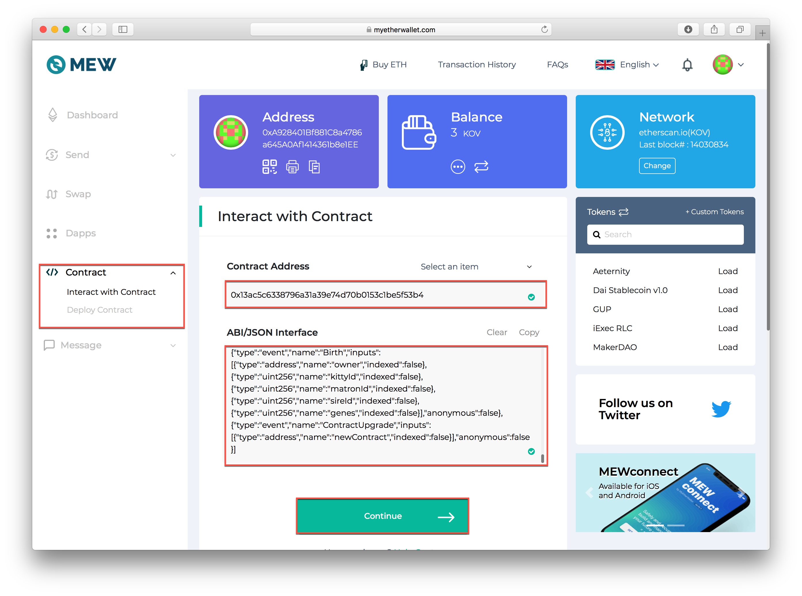

# MyEtherWallet \(MEW\) Transfer


Instructions in process.


## **Transfer a Kitty from Kovan to Sokol** 


You will need a small amount of KETH to complete the transfer.  You can obtain here: [https://gitter.im/kovan-testnet/faucet](https://gitter.im/kovan-testnet/faucet)


1\) Login to [MyEtherWallet](https://www.myetherwallet.com/), change the network to Kovan \(KOV\)

2\) Approve the token you will transfer with the bridge:

* Open a second browser tab to view[ the Kitties contract in Blockscout](https://blockscout.com/eth/kovan/address/0x13ac5c6338796a31a39e74d70b0153c1be5f53b4/contracts). Go to the "Code" tab, scroll down below the Contract Source Code, and copy the Contract ABI code.

* Select **Contract** from the left hand menu \(you may need to expand your browser window to see\) and add
  * Contract Address:  `0x13ac5c6338796a31a39e74d70b0153c1be5f53b4` 
  * Copied ABI to the ABI/JSON interface text area.
  * Click **Continue**

* In the Select an item dropdown menu, choose the `approve` method. 
  *  `_to(address)` parameter: paste the mediator contract address `0x7dB6493D9B6D99D9A240a6914AdAd5e0E8E8BE40`
  *  `_tokenId` parameter: insert the Id of the token you want to transfer. 
  * Value in Eth: Keep at 0
  * Press `Write` and confirm the transaction.

* Press "Back" in the MEW interface.

   3. Initiate the token transfer:

* Visit in another browser tab [the Mediator contract in Blockscout](https://blockscout.com/eth/kovan/address/0x7db6493d9b6d99d9a240a6914adad5e0e8e8be40/read_contract), go to the "Read Contract" tile and click to the address in the `implementation` field:   

* Go to the "Code" tile of the implementation of the mediator contract and copy ABI there.
* Add the contract to MEW by using the address `0x7db6493d9b6d99d9a240a6914adad5e0e8e8be40` and copied ABI.

* Make a transaction to execute the `transferToken` method: on `_from` parameter paste the address of your account that will receive the token on the other network, in `_tokenId` parameter insert the Id of the token you want to transfer. Press `Write` and confirm the transaction confirmation.

As soon as the transaction confirmed the token will be locked in the Mediator contract in Kovan: 

After waiting a couple of seconds to allow the AMB bridge perform their operations, check the [token contract on Sokol](https://blockscout.com/poa/sokol/tokens/0xc6a592ED792de33e6CBBF7ce04Dd9D3884B46B9A/inventory) and see that the token bridged is now Minted with the same Id: 

and metadata

**Transfer Kitty from Sokol to Kovan**

No difference for the transferring a NFT in this direction except another contract addresses.

1. Make sure that you are on the Sokol network in MEW
2. Approve the token to be transferred by the bridge:
   * Visit [the Kitties contract in Blockscout](https://blockscout.com/poa/sokol/address/0xc6a592ED792de33e6CBBF7ce04Dd9D3884B46B9A/contracts), go to the "Code" tile and copy ABI there.
   * Add the contract to MEW by using the address `0xc6a592ED792de33e6CBBF7ce04Dd9D3884B46B9A` and copied ABI.
   * Make a transaction to execute the `approve` method: on `_to` parameter paste the mediator contract address `0x7dB6493D9B6D99D9A240a6914AdAd5e0E8E8BE40`, in `_tokenId` parameter insert the Id of the token you want to transfer. Press `Write` and confirm the transaction confirmation.
3. Initiate the token transfer:
   * Visit in another browser tab [the Mediator contract in Blockscout](https://blockscout.com/poa/sokol/address/0x5EeC77239398FE328791E28700CAFddB2990ea97/read_contract), go to the "Read Contract" tile and click to the address in the `implementation` field:
   * Go to the "Code" tile of the implementation of the mediator contract and copy ABI there.
   * Add the contract to MEW by using the address `0x5EeC77239398FE328791E28700CAFddB2990ea97` and copied ABI.
   * Make a transaction to execute the `transferToken` method: on `_from` parameter paste the address of your account that will receive the token on the other network, in `_tokenId` parameter insert the Id of the token you want to transfer. Press `Write` and confirm the transaction confirmation.

When the token is transferred in the opposite direction, it is burned in Sokol and unlocked on Kovan. After waiting a couple of seconds to allow the AMB bridge perform their operations, check the [token contract on Kovan](https://blockscout.com/eth/kovan/tokens/0x13AC5C6338796a31A39e74D70B0153C1bE5f53B4/inventory) and see that the token bridged is now owned by your account again with the same Id and metadata as before.

