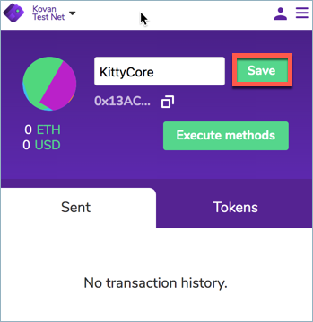

# NiftyWallet Transfer

## **Transfer Cat: Kovan to Sokol**


You will need a small amount of KETH to complete the transfer process.  You can obtain here: [https://gitter.im/kovan-testnet/faucet](https://gitter.im/kovan-testnet/faucet)



In order to follow the process with your own kitties, you must first [deploy your own contracts](https://app.gitbook.com/@poa/s/tokenbridge/~/edit/drafts/-LrL6654d2nfg9pCMDSD/amb-bridge/deploy-cryptokitty-contracts) and use those contract addresses here.


### 1\) Log into your wallet through the [Nifty wallet chrome extension](https://chrome.google.com/webstore/detail/nifty-wallet/jbdaocneiiinmjbjlgalhcelgbejmnid). 

Note: This should be the owner wallet address if you followed the deployment process.

### 2\) Select the Kovan Test Network.

### 3\) Add **KittyCore** contract

* Copy the contract address.  
  In our example we use our example KittyCore contract address `0x13AC5C6338796a31A39e74D70B0153C1bE5f53B4` . If you deployed your own contract, use the \[ Foreign \] kittyCore: `0x........` address from [deployment step 5](deploy-cryptokitty-contracts.md#5-deploy-your-contracts) here.

 

* In Nifty Wallet:
  * 1\) Open accounts menu and scroll to the bottom
  * 2\) Click on `Import Account`

* **Select Type:** `Contract` 
  * 1\) paste in the contract address`0x13AC5C6338796a31A39e74D70B0153C1bE5f53B4`

     The ABI will be fetched automatically.

  * 2\) Click **Import**

* It is useful to edit the name of the imported contract. 
  * 1\) For example rename to `KittyCore`. Hover over the created name \(Account \#\) and edit text will appear. Click on **edit** and ****change the name
  * 2\) click **Save**.

### 4\) Add Mediator \(Proxy\) contract

* Copy the contract address: `0x7dB6493D9B6D99D9A240a6914AdAd5e0E8E8BE40`.   
  * If you deployed your own contract, use the \[ Foreign \] Mediator: `0x........` address from [deployment step 5](deploy-cryptokitty-contracts.md#5-deploy-your-contracts) here.
* Enter `Import Account` section
* **Select Type:** `Proxy` as type and paste the address of the contract
* After ABI is loaded, click **Import**.
* Rename contract if desired. We rename to `Mediator_k`.

Now that we have the token and mediator contracts available, we will perform 2 transactions to transfer the token from Kovan to Sokol.  First, call the `approve` method of the token contract,  then call the `transferToken` of mediator contract.

### 5\) Approve Method of Token \(KittyCore\) Contract

* Select KittyCore contract in Nifty Wallet and click  `Execute methods` button


You must own the token you are attempting to transfer. You cannot transfer a token owned by another address.


* 1\) Select the `approve` method
* 2\) in `_to` parameter, paste the mediator contract address. If you deployed your own contracts, you will use the  \(\[ Foreign \] Mediator  `0x.........`  address\) Example:`0x7dB6493D9B6D99D9A240a6914AdAd5e0E8E8BE40` 
* 3\) in `_tokenId` parameter insert the Id of the token you want to transfer. You can see the tokenIDs you own in the [View Kitties in BlockScout](view-in-blockscout.md) instructions.
* 4\)  Click **Next**

* Select the wallet account that will send the transaction. **This must be sent with the account that owns the token.**

* Submit the transaction and wait until it is mined.

### 6\) TransferToken Method of Mediator\_k Contract

Now let's call `transferToken` to make the transfer and bridge the token.

* Select Mediator\_k contract on Nifty Wallet and click the `Execute methods` button.

* 1\) Select `transferToken` method
* 2\) in `_from` parameter paste the address of your account \(same as original ownership address\) that will receive the token on the other network
* 3\) in `_tokenId` parameter insert the Id of the token you want to transfer


You must transfer the token to the **same wallet address on the other network**. You cannot transfer between accounts, the account address must be the same, and the token id must match the id of your owned token.


* 4\) Click **Next**

* Select the account that will send the transaction. **This can be any account** that contains the required amount of KETH to complete the transaction.
* Submit the transaction and wait until it is mined.

Now the token is locked in the Mediator contract in Kovan. Allow a few seconds to process the transaction, then check the [token contract on Sokol](https://blockscout.com/poa/sokol/tokens/0xc6a592ED792de33e6CBBF7ce04Dd9D3884B46B9A/inventory) to see that the token is minted with the same ID and Metadata.

## **Transfer Cat: Sokol to Kovan**

The process is similar when transferring from Sokol back to Kovan. 


You can get Sokol Test Tokens here: [https://faucet-sokol.herokuapp.com/](https://faucet-sokol.herokuapp.com/)


Select **Sokol Test Network** on Nifty Wallet

### 1\) Add **SimpleBridgeKitty** contract

* Copy the contract address: `0xc6a592ED792de33e6CBBF7ce04Dd9D3884B46B9A`
* On Nifty Wallet click on `Import Account` menu
* Select `Contract` as type and paste the address of the contract. 
* Click **Import**
* It is useful to edit the name of the imported contract to for example `SimpleBridgeKitty`

###  2\) Add Mediator contract

* Copy the contract address: `0x5EeC77239398FE328791E28700CAFddB2990ea97`
* Enter `Import Account` section
* Select `Proxy` as type and paste the address of the contract
* After ABI is loaded, click on Import button.

Again, two transactions are needed to bridge the token back to Kovan

### 3\) Approve Method of Token \(SimpleBridgeKitty\) Contract

Follow the steps explained above to call `approve` method of the token contract. 

* On `_to` parameter paste the mediator contract address `0x5EeC77239398FE328791E28700CAFddB2990ea97`
* In `_tokenId` parameter insert the Id of the token you want to transfer. **Send transaction with the account where you own the Cat**.

### 4\) TransferToken Method of Mediator Contract 

Follow the explained steps to call `transferToken` of mediator contract. 

* On `_from` parameter paste the address of your account \(**same account where Cat is owned on Sokol**\) that will receive the token on the other network
* In `_tokenId` parameter insert the Id of the token you want to transfer.

### Success!

In this case the token is burned in Sokol. After waiting several seconds to allow the AMB bridge perform operations we can check the [token contract on Kovan](https://blockscout.com/eth/kovan/tokens/0x13AC5C6338796a31A39e74D70B0153C1bE5f53B4/inventory) and see that the bridged token is now owned by your account again with the same ID and metadata as before.

