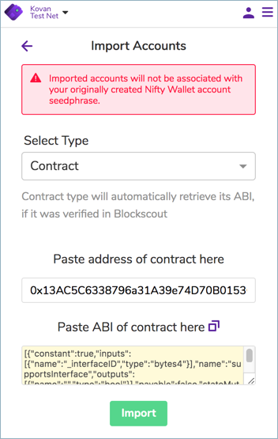

# NiftyWallet Transfer

## **Transfer Kitty: Kovan to Sokol**


You will need a small amount of KETH to complete the transfer process.  You can obtain here: [https://gitter.im/kovan-testnet/faucet](https://gitter.im/kovan-testnet/faucet)


1\) Log into your wallet through the [Nifty wallet chrome extension](https://chrome.google.com/webstore/detail/nifty-wallet/jbdaocneiiinmjbjlgalhcelgbejmnid).

2\) Select the Kovan Test Network.

### 3\) Add **KittyCore** contract

* Copy the contract address: `0x13AC5C6338796a31A39e74D70B0153C1bE5f53B4`
* In Nifty Wallet, scroll to the bottom of the Accounts menu and  click on `Import Account`

* **Select Type:** `Contract`  and paste in the contract address`0x13AC5C6338796a31A39e74D70B0153C1bE5f53B4`

   The ABI will be fetched automatically.

* Click **Import**
* It is useful to edit the name of the imported contract. For example rename to `KittyCore`. Hover  over the created name \(Account \#\) and edit text will appear. Click on **edit**, change the name, and click **Save**.

### 4\) Add Mediator \(Proxy\) contract

* Copy the contract address: `0x7dB6493D9B6D99D9A240a6914AdAd5e0E8E8BE40`
* Enter `Import Account` section
* **Select Type:** `Proxy` as type and paste the address of the contract
* After ABI is loaded, click **Import**.
* Rename contract if desired. We rename to `Mediator_K`.

Now that we have the token and mediator contracts available, we will perform 2 transactions to transfer the token from Kovan to Sokol.  First, call the `approve` method of the token contract,  then call the `transferToken` of mediator contract.

### Approve Method of Token \(KittyCore\) Contract

5\) Select KittyCore contract in Nifty Wallet.

2\) Click on `Execute Methods` button

3\) Select the `approve` method

* in `_to` parameter, paste the mediator contract address `0x7dB6493D9B6D99D9A240a6914AdAd5e0E8E8BE40` 
* in `_tokenId` parameter insert the Id of the token you want to transfer.


You must own the token you are attempting to transfer. You cannot transfer a token owned by another address. Contact us [on our forum](https://forum.poa.network/c/tokenbridge/) to receive a test token.


4\) Click **Next.**

5\) Select the wallet account that will send the transaction. **This must be sent with the account that owns the token.**

6\) Submit the transaction and wait until it is mined.

### TransferToken Method of Mediator\_K Contract

Now let's call `transferToken` to make the transfer and bridge the token.

1\) Select Mediator\_K contract on Nifty Wallet.

2\) Click the **Execute methods** button

3\) Select `transferToken` method

* in `_from` parameter paste the address of your account \(same as original ownership address\) that will receive the token on the other network
* in `_tokenId` parameter insert the Id of the token you want to transfer


You must transfer the token to the **same wallet address on the other network**. You cannot transfer between accounts, the account address must be the same, and the token id must match the id of your owned token.


* Click **Next.**
* Select the account that will send the transaction. **This can be any account** that contains the required amount of KETH to complete the transaction.
* Submit the transaction and wait until it is mined.

Now the token is locked in the Mediator contract in Kovan. Allow a few seconds to process the transaction, then check the [token contract on Sokol](https://blockscout.com/poa/sokol/tokens/0xc6a592ED792de33e6CBBF7ce04Dd9D3884B46B9A/inventory) to see that the token is  minted with the same Id and Metadata

## **Transfer Kitty: Sokol to Kovan**

The process is similar when transferring from Sokol back to Kovan. 


You can get Sokol Test Tokens here: [https://faucet-sokol.herokuapp.com/](https://faucet-sokol.herokuapp.com/)


Select Sokol Test Network on Nifty Wallet

### Add **SimpleBridgeKitty** contract

* Copy the contract address: `0xc6a592ED792de33e6CBBF7ce04Dd9D3884B46B9A`
* On Nifty Wallet click on `Import Account` menu
* Select `Contract` as type and paste the address of the contract. 
* Click **Import**
* It is useful to edit the name of the imported contract to for example `SimpleBridgeKitty`

###  Add Mediator contract

* Copy the contract address: `0x5EeC77239398FE328791E28700CAFddB2990ea97`
* Enter `Import Account` section
* Select `Proxy` as type and paste the address of the contract
* After ABI is loaded, click on Import button.

Again, two transactions are needed to bridge the token back to Kovan

### Approve Method of Token Contract

Follow the explained steps to call `approve` method of the token contract. On `_to` parameter paste the mediator contract address `0x5EeC77239398FE328791E28700CAFddB2990ea97`, in `_tokenId` parameter insert the Id of the token you want to transfer. Send transaction with the account where you own the Kitty.

### TransferToken Method of Mediator Contract 

Follow the explained steps to call `transferToken` of mediator contract. On `_from` parameter paste the address of your account \(same account where Kitty is owned on Sokol\) that will receive the token on the other network, in `_tokenId` parameter insert the Id of the token you want to transfer.

### Finish

In this case the token is burned in Sokol. After waiting a couple of seconds to allow the AMB bridge perform their operations we can check the [token contract on Kovan](https://blockscout.com/eth/kovan/tokens/0x13AC5C6338796a31A39e74D70B0153C1bE5f53B4/inventory) and see that the token bridged is now owned by your account again with the same Id and metadata as before.

