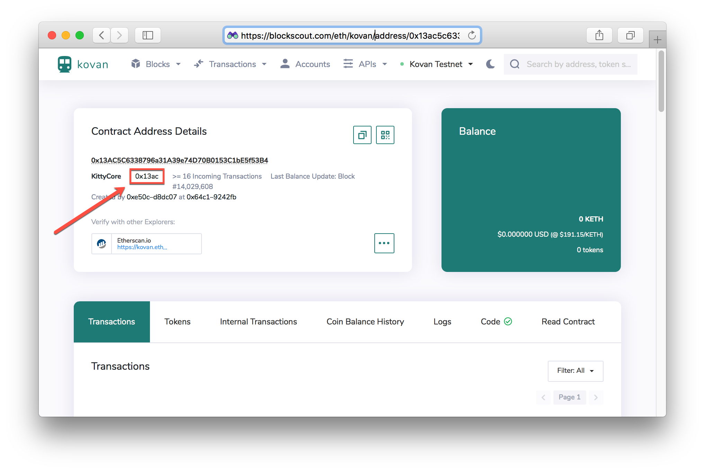
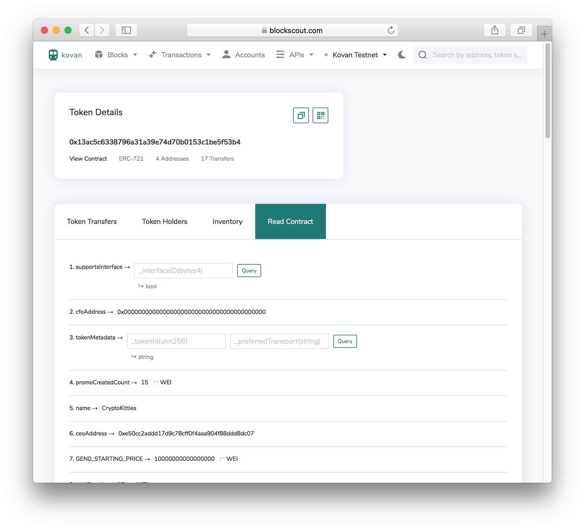
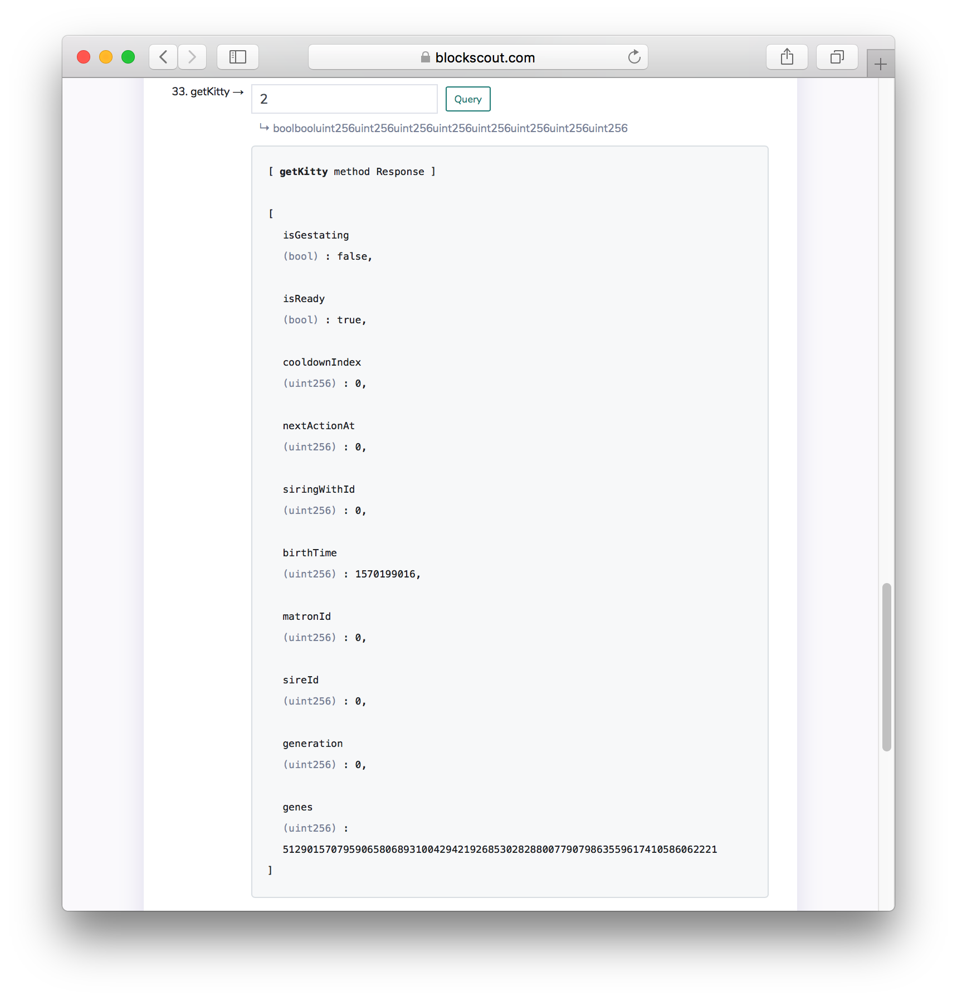

# View Kitties in BlockScout

## Display Kitties

1\) Go to BlockScout on Kovan and enter in the contract address:  
[https://blockscout.com/eth/kovan/address/0x13ac5c6338796a31a39e74d70b0153c1be5f53b4](https://blockscout.com/eth/kovan/address/0x13ac5c6338796a31a39e74d70b0153c1be5f53b4)

2\) To view all kitties and their owners, go to the [Inventory](https://blockscout.com/eth/kovan/tokens/0x13ac5c6338796a31a39e74d70b0153c1be5f53b4/inventory) section. You can access by clicking the shortened token hex next to **KittyCore**, then navigating to the Inventory tab.

3\) Select the [Read Contract](https://blockscout.com/eth/kovan/tokens/0x13ac5c6338796a31a39e74d70b0153c1be5f53b4/read_contract)  section to call different methods. Call the `getKitty` method with the Token ID to get metadata for that kitty.

