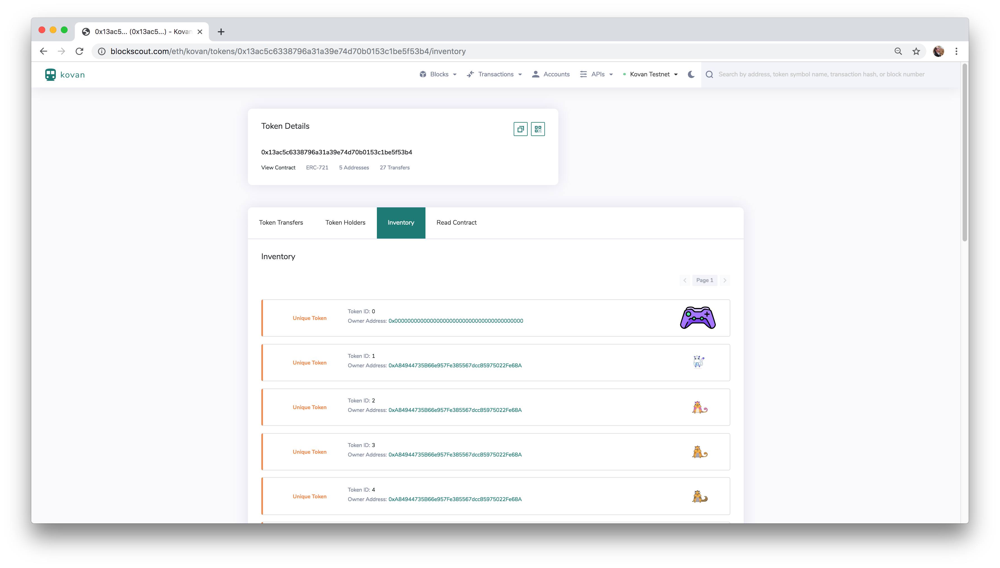
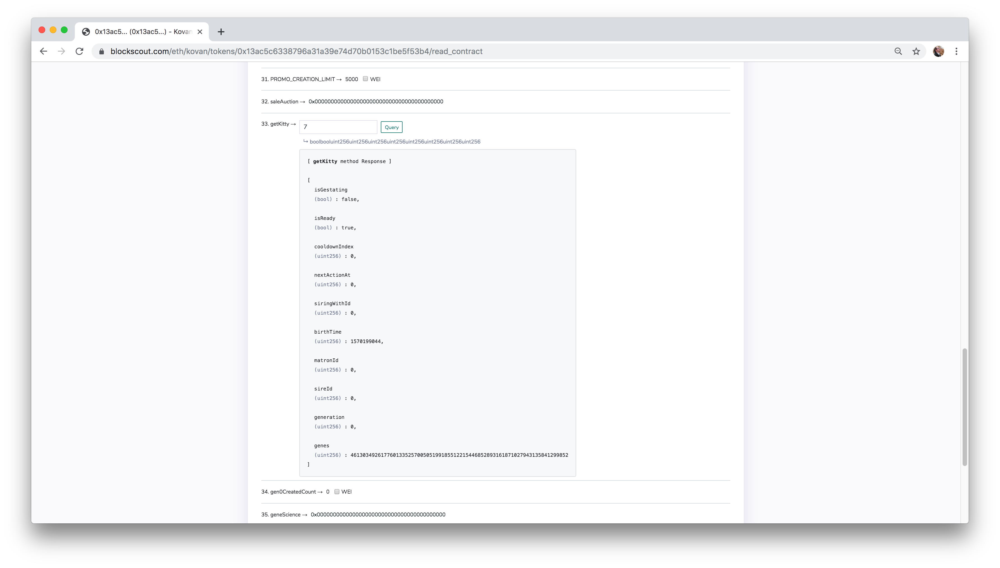

# View Cats in BlockScout

## Display Cats


Contracts must be verified before you can view and interact with methods. See [Verify Contracts in BlockScout](verify-contracts-in-blockscout.md) for details.


### 1\) Go to BlockScout on Kovan with KittyCore contract address

* Example: [https://blockscout.com/eth/kovan/address/0x13ac5c6338796a31a39e74d70b0153c1be5f53b4](https://blockscout.com/eth/kovan/address/0x13ac5c6338796a31a39e74d70b0153c1be5f53b4)


To view kitties created during the deployment process, use the KittyCore contract address: `0x....12` address ie. _https://blockscout.com/eth/kovan/address/0x...12_  or go to the Kovan BlockScout instance and enter the deployed address into the Search bar.

To view kitties you have bridged to Sokol, use the SimpleBridgeKitty ****address.


### 2\) View all Kitties and their Owners

* Go to the [Inventory](https://blockscout.com/eth/kovan/tokens/0x13ac5c6338796a31a39e74d70b0153c1be5f53b4/inventory) section. 
* **Click the shortened token hex** next to KittyCore, then navigate to the Inventory tab.

### 3\) Select the [Read Contract](https://blockscout.com/eth/kovan/tokens/0x13ac5c6338796a31a39e74d70b0153c1be5f53b4/read_contract) section to call different methods. 

* Call the `getKitty` method with the **Token ID** to get metadata for that cat.

### 4\) View Individual Cat data

To view an individual NFT, **click on the token ID number** wherever you see it. This is from the [Inventory](https://blockscout.com/eth/kovan/tokens/0x13ac5c6338796a31a39e74d70b0153c1be5f53b4/inventory) section view.

