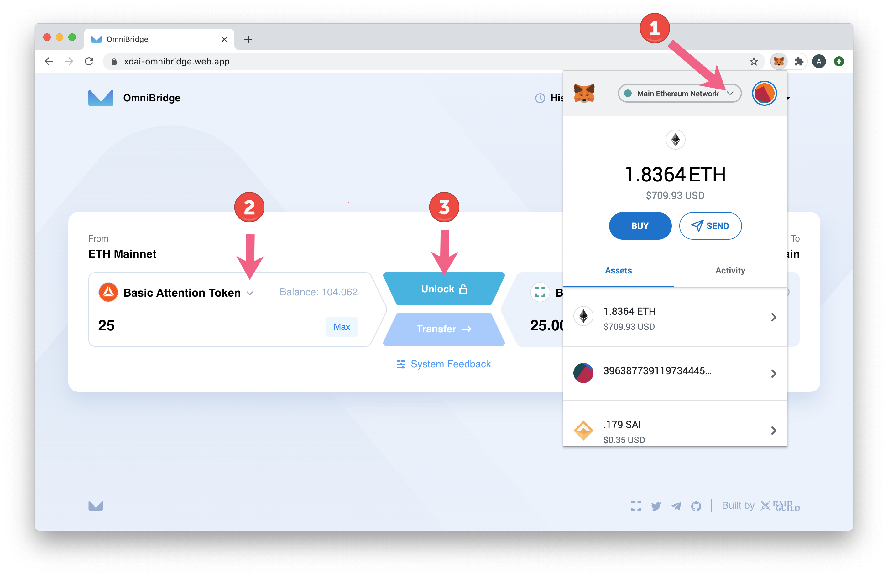
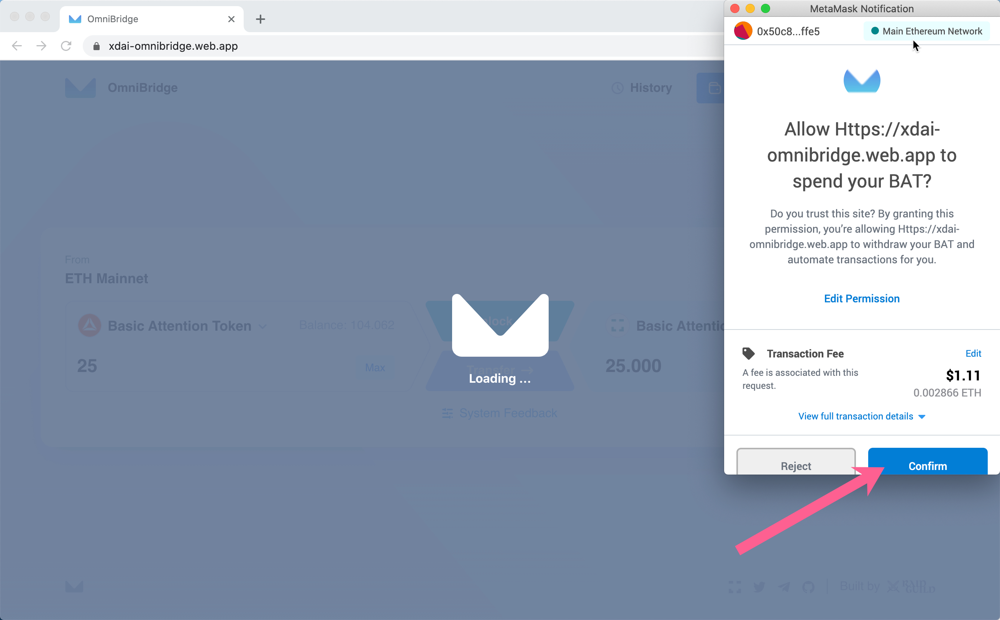
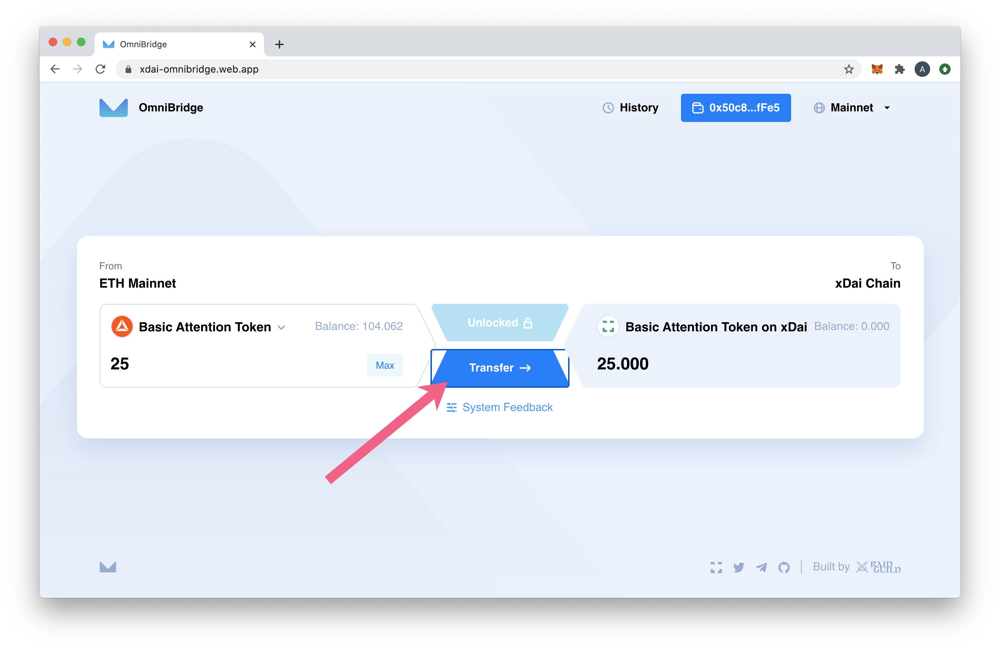
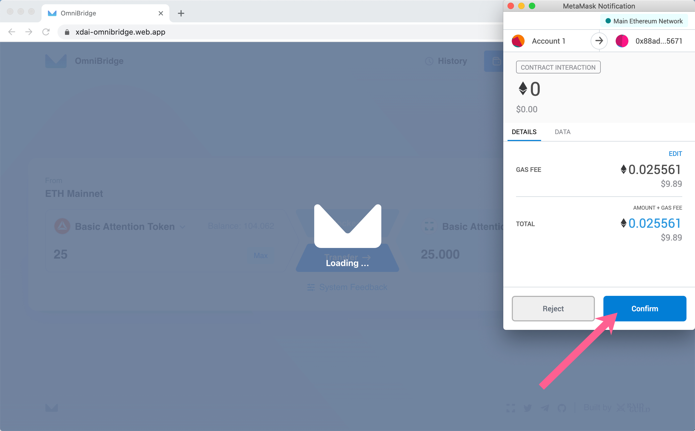
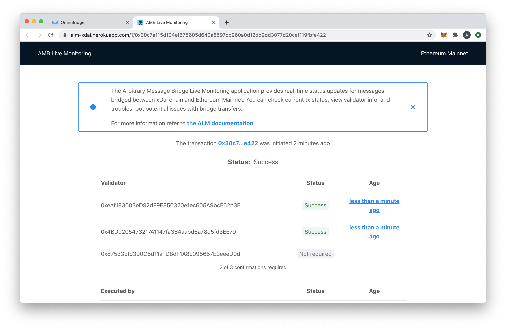
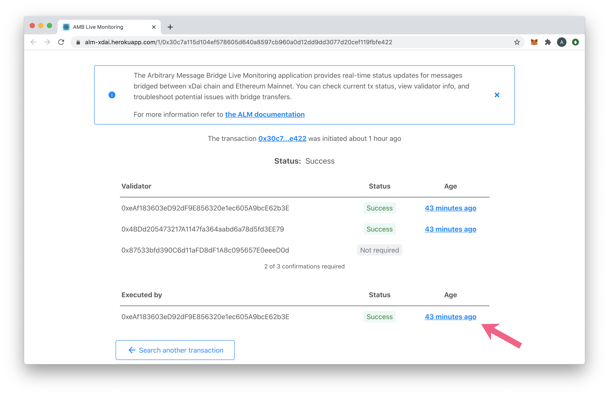
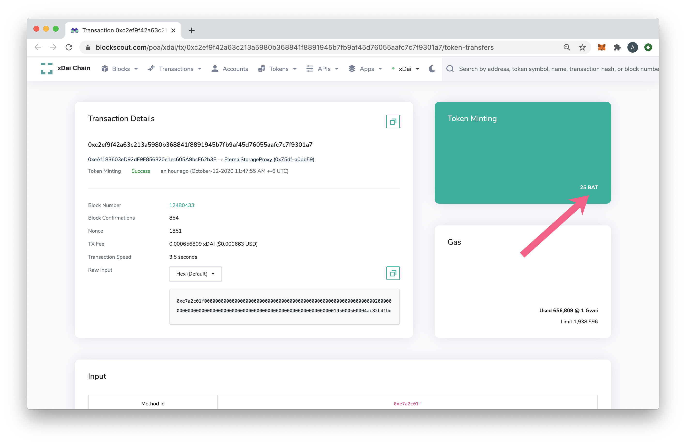
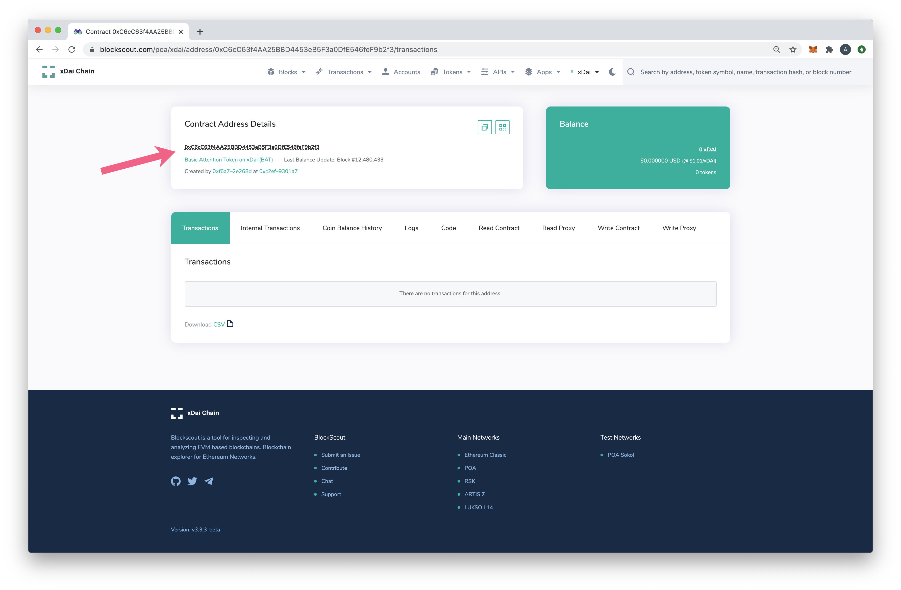

# Transfer any ERC20 from Ethereum to xDai

It is possible to use the OmniBridge UI to transfer any ERC20 from Ethereum to xDai. Any user can initiate this initial transfer. Once the token exists on xDai, it can be transferred back and forth using the same UI.


OmniBridge and OmniBridge UI are experimental Beta software, use at your own risk. Access the unofficial OmniBridge UI: [https://omni.xdaichain.com/](https://omni.xdaichain.com)


## Token Transfer

In this example, we transfer the Basic Attention Token (BAT) from Ethereum to xDai. When we start, this token does not yet exist on xDai. It takes less than 5 minutes and some ETH for gas fees.

1\) Go to the OmniBridge UI at [https://omni.xdaichain.com/](https://omni.xdaichain.com)

1. Connect your MetaMask to Ethereum Mainnet
2. Select the Token you want to transfer (here we select BAT) and enter the amount.
3. Click Unlock to approve account interaction.

2\) Confirm the transaction to approve Omnibridge.

3\) Once approve TX is complete, you can now Transfer BAT to BAT on xDai. Click **Transfer.**

4\) Press **Confirm** to approve the transfer and pay the gas fees. These may be expensive depending on network congestion. We recommend checking current gas prices ([https://ethgas.watch/](https://ethgas.watch)), and it also may make sense to bridge over a larger amount of tokens in a single transaction.

5\) The bridge transaction will begin to process. While you are waiting for block confirmations, you can click on the ALM monitor link to view progress with your transfer.

6\) Transfer processing in ALM.

.jpg>)

7\) After a successful transfer, you can check the token on BlockScout to see that it exists. Check Bridged tokens at [https://blockscout.com/xdai/mainnet/bridged-tokens](https://blockscout.com/xdai/mainnet/bridged-tokens).

a. Prior to transaction

.jpg>)

b. After transaction

## Add the New Token to MetaMask

Now that you have bridged to xDai, you will need to add the token to MetaMask to view.

1\) Switch your MetaMask to the xDai chain (if you haven't setup yet, instructions here). Click on Assets, then scroll down and click Add Token.

.jpg>)

2\) Select **Custom Token** and paste in the address from your newly bridged token. You can find this in several ways. The remaining fields should autopopulate (Symbol and Decimals of Precision). Click Next.\
_Note: Do not use the search feature, as this will search for tokens on Ethereum Mainnet._

3\) Click **Add Tokens** to add to your wallet on the xDai chain.

## Find a Custom Token Address on xDai

There are several ways to find the Custom token address on xDai using BlockScout.

1\) BlockScout Bridged Token List. If you successfully bridged a token with the OmniBridge, you can find it at [https://blockscout.com/xdai/mainnet/bridged-tokens](https://blockscout.com/xdai/mainnet/bridged-tokens).

2\) Via your address on BlockScout. Paste your address into the BlockScout Search bar at [https://blockscout.com/xdai/mainnet](https://blockscout.com/xdai/mainnet) and click the Tokens tab to see all the tokens associated with your address on xDai.

3\) Search by the token name in BlockScout.

4\) When bridging, you can click on the executed ALM Transaction to locate newly minted tokens.

## Switch Bridges & Networks in UI

### Bridges

The OmniBridge UI supports several bridges. To switch chains, click on the Bridge Selector to choose. Once selected, a popup will instruct you to change networks in MetaMask. Click the buttons directly in the popup to complete the process.

### Networks

When switching between networks within the same bridge, press the arrows icon then confirm the network switch in MetaMask.

