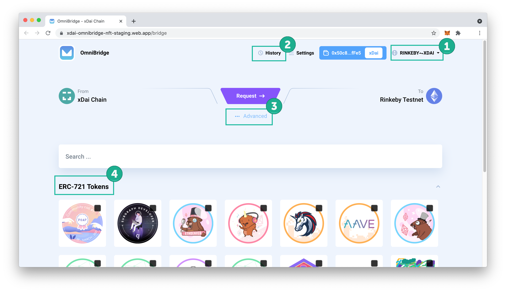
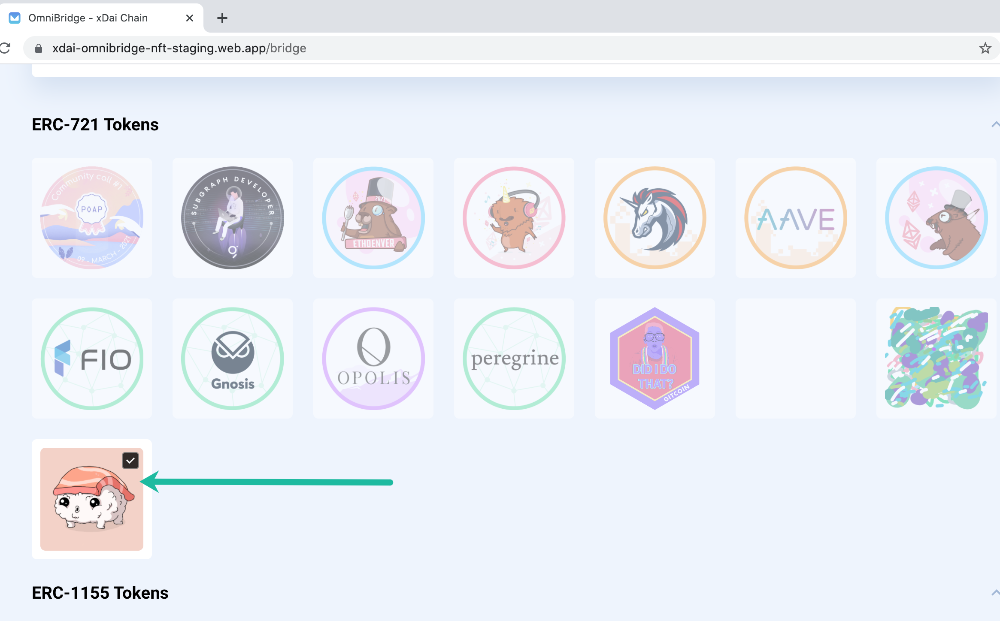
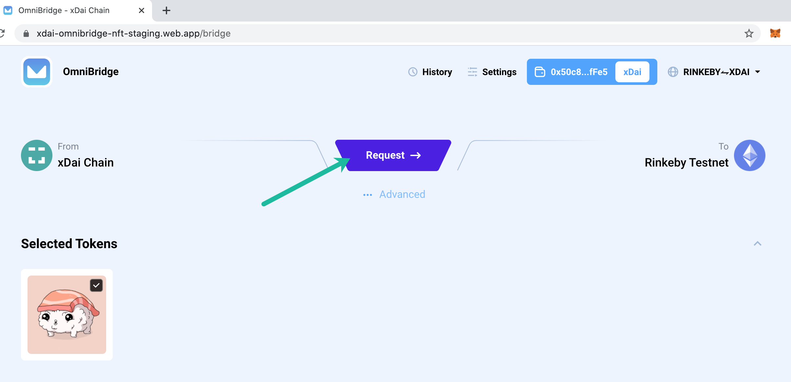
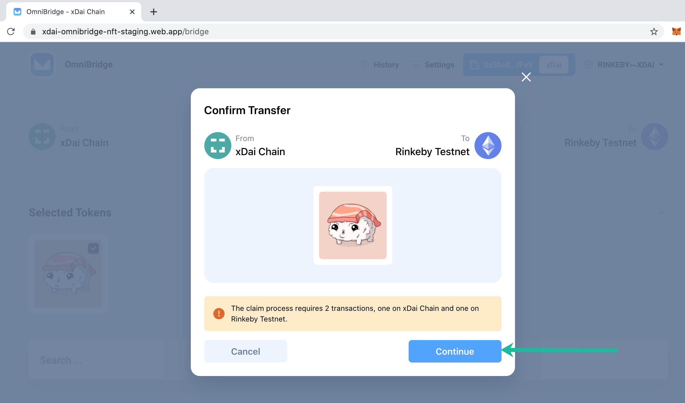
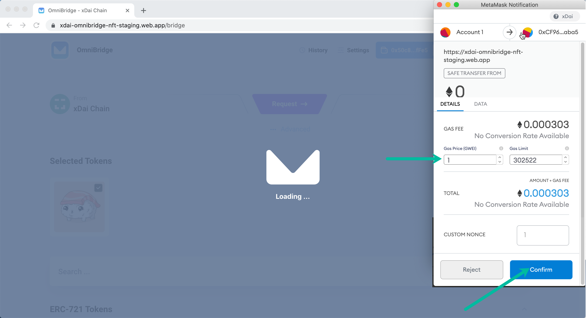
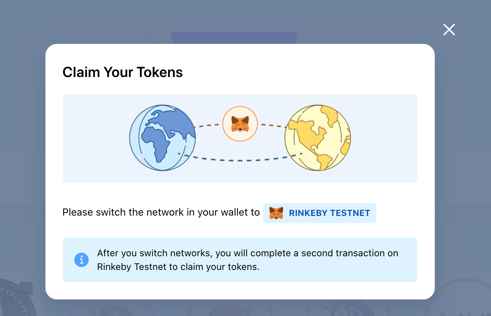
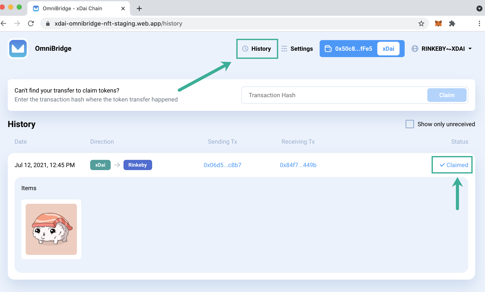
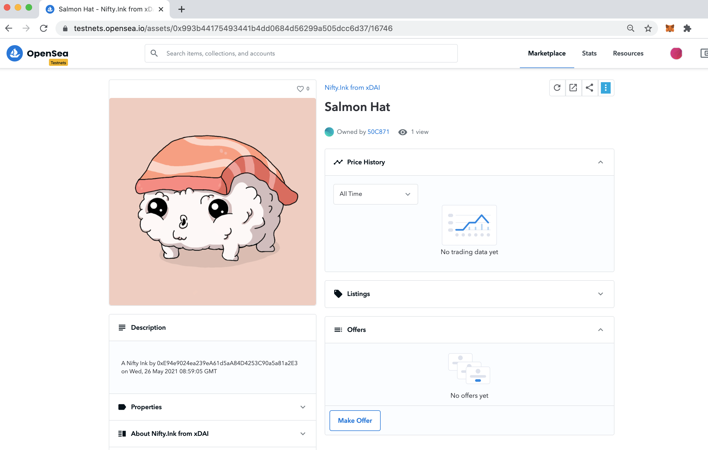

# UI Beta

NFT UI is now in Beta, with additional features and functionality in progress. To test, go to [https://xdai-omnibridge-nft-staging.web.app/](https://xdai-omnibridge-nft-staging.web.app/.)

Current functionality is inherited from the OmniBridge UI for ERC20s and includes:

1. **Network Switcher.** There is current support for 2 bridges, Rinkeby&lt;-&gt;xDai and Mainnet&lt;-&gt;xDai. Switching to the appropriate network in MetaMask will also influence the display.
2. **History Tab**. Shows previous transactions and any available claims.
3. **Advanced.** Use to set an alternate receiving address on the destination chain \(send to another address\)
4. **ERC-721 & ERC-1155 Support**. Scroll down to see any ERC-1155 Tokens owned by the connected address.


The NFT Extension is in Beta and transfers are performed at your own risk. NFT transfers can be very expensive and are not reversible once you initiate a transfer. Keep this in mind when deciding whether or not to bridge NFTs between xDai and Ethereum.


## Simple Transfer Instruction

1\) Connect to your MetaMask wallet and select the network you want to transfer From. Click on  an NFT you want to transfer. You can see information about each NFT on hover, including a link to BlockScout to view additional details.

2\) Once selected, press Request to begin the transfer.

3\) You will see a notice that the transfer will require 2 transactions \(1 to approve the tx, a second to claim on the receiving chain\). Press **Continue**.

4\) Adjust gas price and press confirm to allow start the transfer.

5\) Switch networks in your MetaMask app to the receiving network \(in this case Rinkeby\) to claim your tokens.

6\) View the History tab \([https://xdai-omnibridge-nft-staging.web.app/history](https://xdai-omnibridge-nft-staging.web.app/history)\) to see the claim button and previously claimed transactions. For testing purposes, the xDai &lt;-&gt; Rinkeby bridge is currently set to auto-claim, so the NFT is automatically claimed to your address without needing to process a 2nd claim transaction.

## View and Interact on OpenSea

There is an OpenSea instance on Rinkeby where you can test functionality with a bridged NFT. Go to [https://testnets.opensea.io/](https://testnets.opensea.io/) and connect your MetaMask wallet to Rinkeby to view your recently bridged NFTs. You can [list these for sale ](https://support.opensea.io/hc/en-us/articles/360063498333-How-do-I-list-an-NFT-to-sell-)or perform other actions on the testnet.

