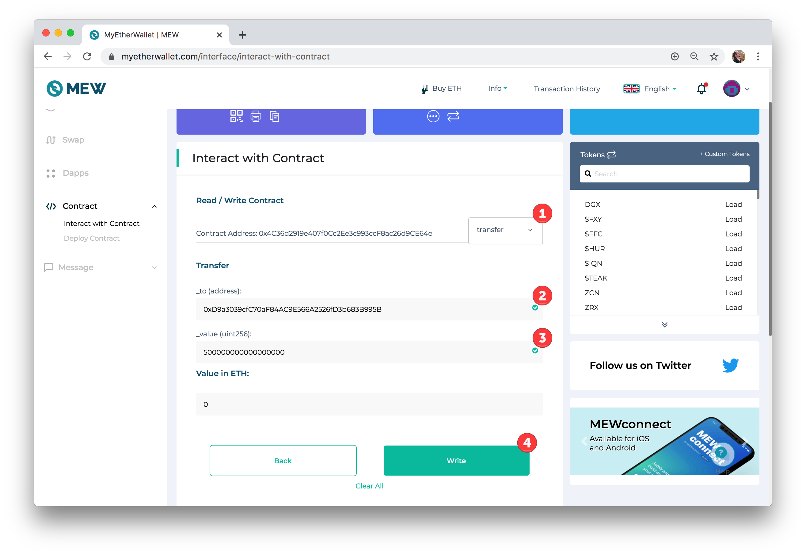

# Send sUSD between two wallets on xDai


sUSD can be sent between any two xDai enabled wallets. You will need a small amount of sUSD on xDai to send from one wallet to another. To transfer sUSD from the Ethereum Mainnet to the xDai Chain, see the [transfer using the bridge extension](transfer-susd-through-the-bridge-extension.md) post.


In this example we use [**Alpha Wallet**](https://alphawallet.com/), a mobile wallet with built-in xDai support, and ****[**Nifty wallet**](https://chrome.google.com/webstore/detail/nifty-wallet/jbdaocneiiinmjbjlgalhcelgbejmnid?hl=en), a web3 enabled wallet similar to MetaMask but better equipped to work with xDai.

1\) Assuming you have transferred sUSD to an address on the xDai chain, open that account in your Alpha Wallet. If you need to import an existing account, [follow these instructions](https://www.xdaichain.com/for-users/wallets/alpha-wallet/importing-an-existing-account-to-alpha-wallet).

2\) Alpha wallet automatically displays all tokens your address contains on both the Ethereum Main network and the xDai chain. Here you can see we have sUSD on Ethereum and sUSD on xDai \(chain is denoted by the colored tag\).

3\) Click the sUSD on the xDai Chain. You will see recent transactions and have the ability to send and receive sUSD. Click **Send**.

4\) Enter \(or scan with the camera icon\) the address you are sending to. We are sending .2 sUSD. Click **Send**.

5\) Wait a few seconds for the transaction to process, then check the receiver's address using Nifty Wallet. You **will not** see your token balance immediately - you need to add the token contract to the wallet in order to view.

a\) Open Nifty wallet and make sure it is connected to the xDai chain. Click **Add Token**.

b\) Enter the sUSD xDAi **Token Contract Address** `0x4C36d2919e407f0Cc2Ee3c993ccF8ac26d9CE64e`The additional details will auto-populate. Click **Add**.

6\) You should now see the sUSD token balance on the xDai chain.

**BlockScout Transaction:**   
[https://blockscout.com/poa/xdai/tx/0xba2f7da9bf6277149b073af5bd0f69e5bfae17b03626bbc545e8fdf8441bdf36/token\_transfers](https://blockscout.com/poa/xdai/tx/0xba2f7da9bf6277149b073af5bd0f69e5bfae17b03626bbc545e8fdf8441bdf36/token_transfers)

