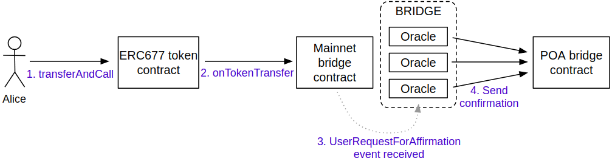

# Transfer sUSD through the bridge extension

One of the simplest way to transfer Synth sUSD tokens through the bridge extension is to use [MyEtherWallet \(MEW\)](https://www.myetherwallet.com/access-my-wallet). MEW can be used for both types of operations: to deposit tokens to the xDai chain and to withdraw tokens from the xDai chain.

## Deposit sUSD tokens to the xDai chain

1. Choose the Ethereum Mainnet in the MetaMask extension and login to [MyEtherWallet \(MEW\)](https://www.myetherwallet.com/access-my-wallet).

2. Initialize the sUSD token contract interface by putting the Synth sUSD token contract address `0x57ab1e02fee23774580c119740129eac7081e9d3` and the following JSON in the **`ABI/JSON Interface`** field: 

```javascript
[{"constant":false,"inputs":[{"name":"spender","type":"address"},
{"name":"value","type":"uint256"}],"name":"approve",
"outputs":[{"name":"","type":"bool"}],"payable":false,
"stateMutability":"nonpayable","type":"function"}]
```


3. Approve the mediator contract to perform operations with tokens:


where

* `Spender` - the address \(`0x71F12d03E1711cb96E11E1A5c12Da7466699Db8D`\) of the mediator contract serving the bridge extension in the Ethereum Mainnet
* `Value` - the amount of tokens \(in Wei\) that is going to be transferred

4. Submit the transaction in the MetaMask and wait when it is included in the chain.

5. Initialize the mediator contract interface by putting the mediator contract address `0x71F12d03E1711cb96E11E1A5c12Da7466699Db8D` and the following JSON in the **`ABI/JSON Interface`** field:

```javascript
[{"constant":false,"inputs":[{"name":"_receiver","type":"address"},
{"name":"_value","type":"uint256"}],"name":"relayTokens","outputs":[],
"payable":false,"stateMutability":"nonpayable","type":"function"},
{"constant":false,"inputs":[{"name":"_from","type":"address"},
{"name":"_receiver","type":"address"},{"name":"_value",
"type":"uint256"}],"name":"relayTokens","outputs":[],"payable":false,
"stateMutability":"nonpayable","type":"function"}]
```



6. Choose an appropriate `relayTokens` method. There are two methods there:

* `relayTokens(address _receiver, uint256 _amount)`- can be used to transfer sUSD tokens to a recipient in the xDai chain.
* `relayTokens(address _from, address _receiver, uint256 _amount)` - intended to be invoked in scenarios when the sUSD tokens deposit is performed by another contract on behalf of a user account \(e.g. by a DEX\)


where

* `_receiver` - the account that will get sUSD tokens on the xDai chain; it is assumed that the same account that deposits the token will be the tokens recipient
* `_amount` -- the amount of tokens \(in Wei\) to transfer; it should be less or equal amount of tokens approved for the bridge operations

7. Submit the transaction in the MetaMask and wait when it is included in the chain.

8. It will require the AMB bridge some time to relay the deposit request to the xDai chain. Eventually the balance of the account that was specified as `_receiver` in the `relayTokens` method call will be increased. The result of the relay operation can be monitored [in Blockscout](https://blockscout.com/poa/xdai/tokens/0x4c36d2919e407f0cc2ee3c993ccf8ac26d9ce64e/token_transfers).

## Withdraw sUSD tokens from the xDai chain

1. Choose the xDai chain in the browser wallet extension and login to [MyEtherWallet \(MEW\)](https://www.myetherwallet.com/access-my-wallet).

2. Initialize the sUSD bridgeable token contract interface by putting the token contract address `0x4C36d2919e407f0Cc2Ee3c993ccF8ac26d9CE64e` and the following JSON in the **`ABI/JSON Interface`** field:

```javascript
[{"type":"function","stateMutability":"nonpayable","payable":false,
"outputs":[{"type":"bool","name":""}],"name":"transfer",
"inputs":[{"type":"address","name":"_to"},{"type":"uint256",
"name":"_value"}],"constant":false}]
```


3. Transfer the sUSD bridgeable tokens to the mediator contract:


where

* `_to` - the address \(`0xD9a3039cfC70aF84AC9E566A2526fD3b683B995B`\) of the mediator contract serving the bridge extension in the xDai chain
* `_value` - the amount of tokens \(in Wei\) that is going to be transferred

The `transfer` method of the bridgeable token contract will automatically notify the the mediator contract about the new amount of tokens appeared on the mediator contract account. That's why no other action is required from the user side to finish the withdrawal request.

4. Submit the transaction in the MetaMask and wait when it is included in the chain.

5. It will require the AMB bridge some time to transfer tokens to the Ethereum Mainnet. Eventually the balance of the account that was specified as `_to` in the `transfer` method call will be increased. The result of the relay operation can be monitored [in Etherscan](https://etherscan.io/token/0x57ab1e02fee23774580c119740129eac7081e9d3?a=0x71f12d03e1711cb96e11e1a5c12da7466699db8d).

