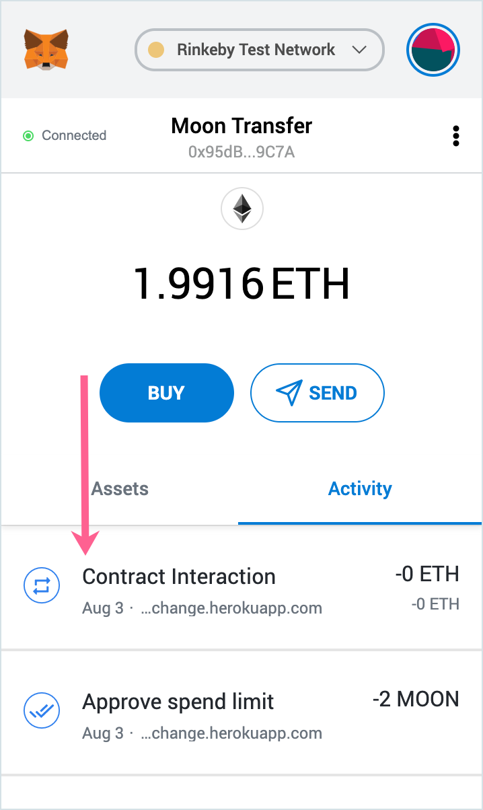
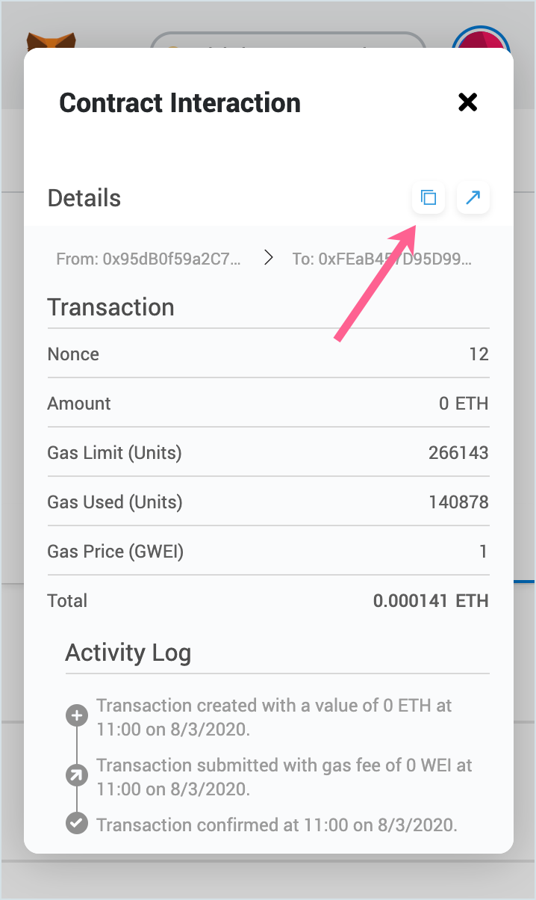
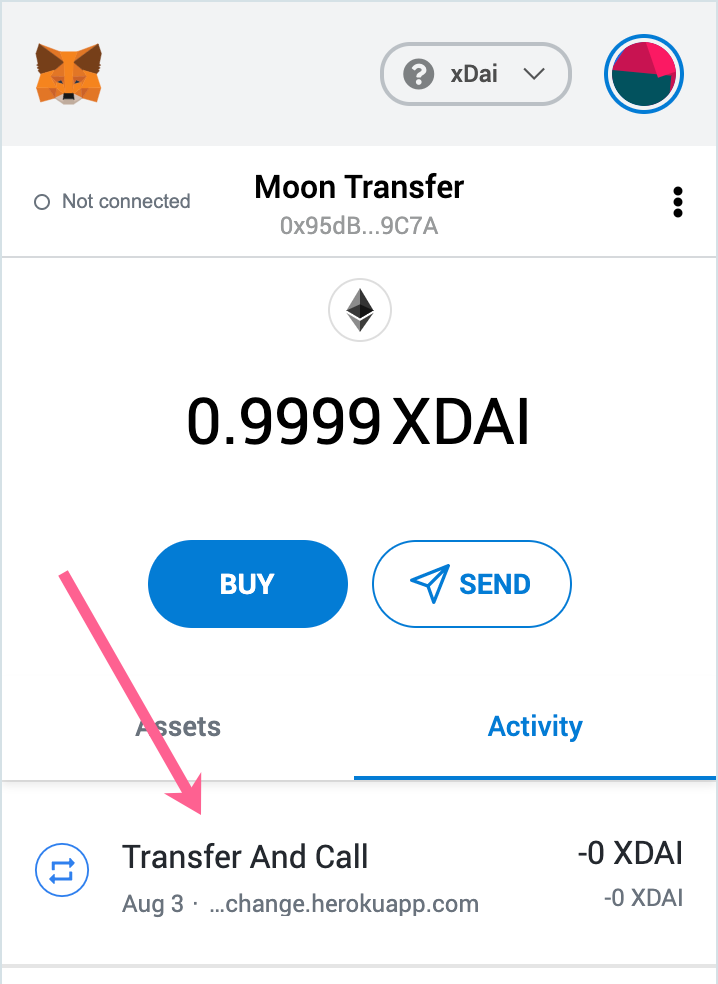
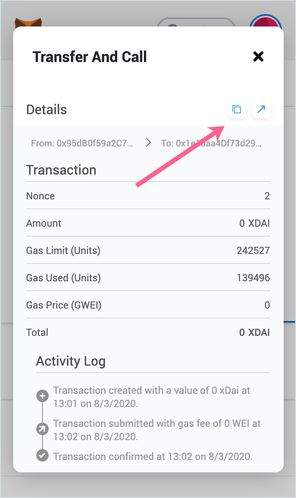

# AMB Live Monitoring application

The Live Monitoring application instance for the Arbitrary Message Bridge between the Rinkeby testnet and the xDai chain is located at [https://alm-rinkeby.herokuapp.com/](https://alm-rinkeby.herokuapp.com/)

The monitoring application shows confirmations and the transaction status for each bridge validator, and can monitor transactions in both directions \(when initiating a transaction from the "Home" or Foreign" chain\). In the xDai &lt;-&gt; Rinkeby bridge, xDai is the Home network with fast and inexpensive operations, and Rinkeby is the Foreign network.

The main aim of the application to track a status of the requests the users are sending through AMB mediators and help to understand the reason why a particular request is not processed yet.

## Getting status for Foreign -&gt; Home \(Rinkeby -&gt; xDai\) transactions

Note that transactions must use the Arbitrary Message Bridge to be monitored \(transactions using a different bridge mode, such as the current xDai &lt;-&gt; Dai bridge are not monitored\).

Foreign -&gt; Home transactions may require two transactions. The first approves the mediator to transfer tokens, and the second to confirm the transaction. In this case the 2nd transaction should be entered into the interface.

### Example transaction hash

[0xf2fbc1b9caf77f7f66ee8ad58ef6b5f49819f2972d68b89d6c9b28eb3cd00ac6](https://rinkeby.etherscan.io/tx/0xf2fbc1b9caf77f7f66ee8ad58ef6b5f49819f2972d68b89d6c9b28eb3cd00ac6)

1\) After completing an AMB bridge transaction \([we transfer MOONs on Rinkeby to xMOONs on xDai using the moon-exchange UI](https://moon-exchange.herokuapp.com/)\), go to the MetaMask Activity tab and select the 2nd transaction \(Contract Interaction\).

2\) Select the transaction and copy the transaction hash. This can be done at any time during or after a transaction. Paste this hash into the ALM monitor to view the transaction status.

### Screenshots

The ALM will auto-update as the transaction progresses through different states. The full list of the states is available on [the ALM documentation page](https://docs.tokenbridge.net/about-tokenbridge/components/amb-live-monitoring-application/alm-transition-states#foreign-greater-than-home-state-transitions).

#### Waiting for a transaction

#### Success

Click on an age metric to view the transaction details in Etherscan.

## Getting status for Home -&gt; Foreign \(xDai -&gt; Rinkeby\) transactions

### Example transaction hash

[0x03c11c1b7510e4e07290634783e73914ffe6b7db60e36e0cb36011863ff66fda](https://blockscout.com/xdai/mainnet/tx/0x03c11c1b7510e4e07290634783e73914ffe6b7db60e36e0cb36011863ff66fda/token-transfers)

1\) After completing an AMB bridge transaction \([we transfer xMOONs on xDai to MOONs on Rinkeby using the moon-exchange UI](https://moon-exchange.herokuapp.com/)\), go to the MetaMask Activity tab and select the transaction \(Transfer & Call\).

2\) Select the transaction and copy the tx hash. This can be done at any time during or after a transaction. Paste this hash into the ALM monitor to view tx status.

### Screenshots

The ALM will auto-update as the transaction progresses through different states. The full list of the states is available on [the ALM documentation page](https://docs.tokenbridge.net/about-tokenbridge/components/amb-live-monitoring-application/alm-transition-states#home-greater-than-foreign-state-transitions).

#### Waiting for Execution

#### Success

Click on an age metric to view the transaction details in BlockScout.

