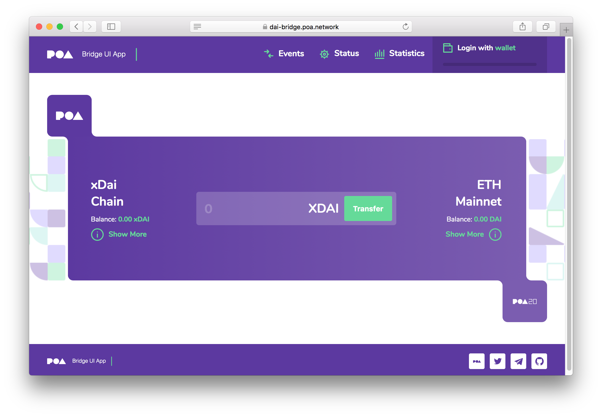

# About the xDai Bridge

There are currently two bridges on xDai that connect it to the Ethereum Mainnet. The ERC-20 to Native Bridge, and the [xDai &lt;-&gt; ETH AMB](../eth-xdai-amb-bridge/about-the-eth-xdai-amb.md). This sections covers the ERC20-Native Bridge.

|  |  |
| :--- | :--- |
| Bridge Type | ERC20 to Native  |
| UI | [https://dai-bridge.poa.network/](https://dai-bridge.poa.network/) |
| Contract on Mainnet Side | [https://etherscan.io/address/0x4aa42145Aa6Ebf72e164C9bBC74fbD3788045016\#readProxyContract](https://etherscan.io/address/0x4aa42145Aa6Ebf72e164C9bBC74fbD3788045016#readProxyContract) |
| Contract on xDai side | [https://blockscout.com/poa/xdai/address/0x7301CFA0e1756B71869E93d4e4Dca5c7d0eb0AA6/transactions ](https://blockscout.com/poa/xdai/address/0x7301CFA0e1756B71869E93d4e4Dca5c7d0eb0AA6/transactions
) |
| Current Validators | [https://dai-bridge.poa.network/status](https://dai-bridge.poa.network/status)  |

The xDai chain uses the ERC20 to Native TokenBridge functionality to provide fast, inexpensive and stable transactions. This bridge allows users to transform DAI \(an ERC20 stable token\) on the mainnet into xDAI on a compatible chain. xDAI tokens can then be sent quickly and with minimal cost on the xDAI network. The xDAI chain has been a breakout success in the Ethereum community, providing an easy way for vendors to accept a stable cryptocurrency.

